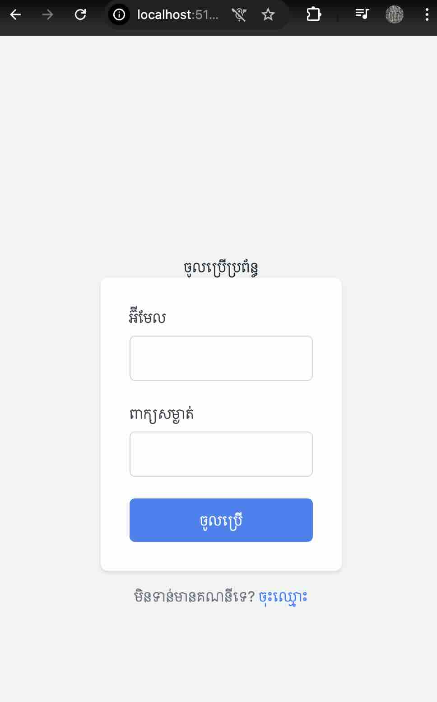
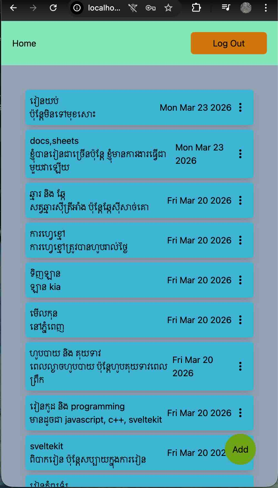
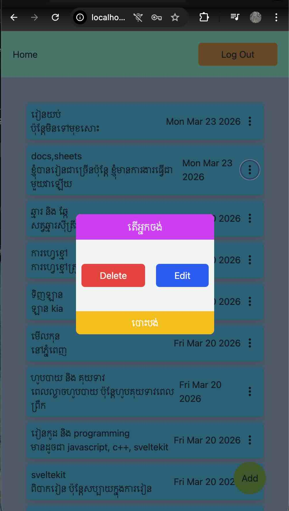
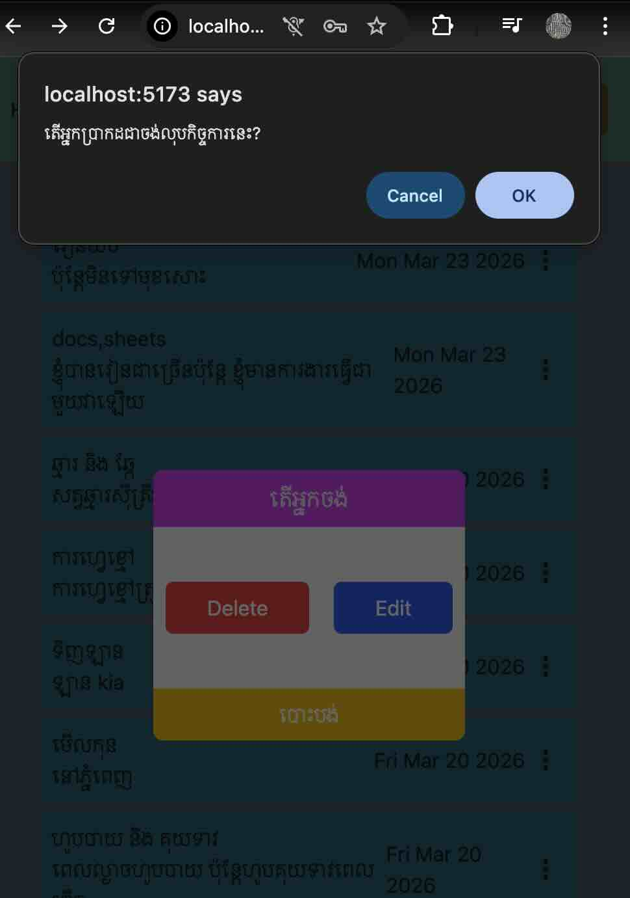
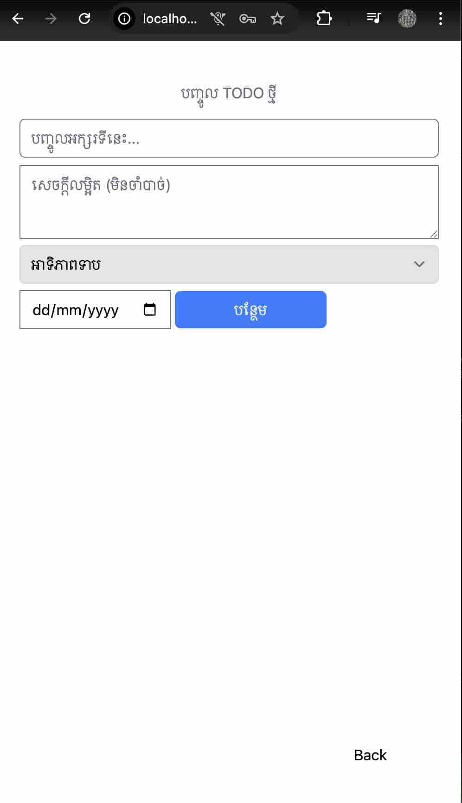
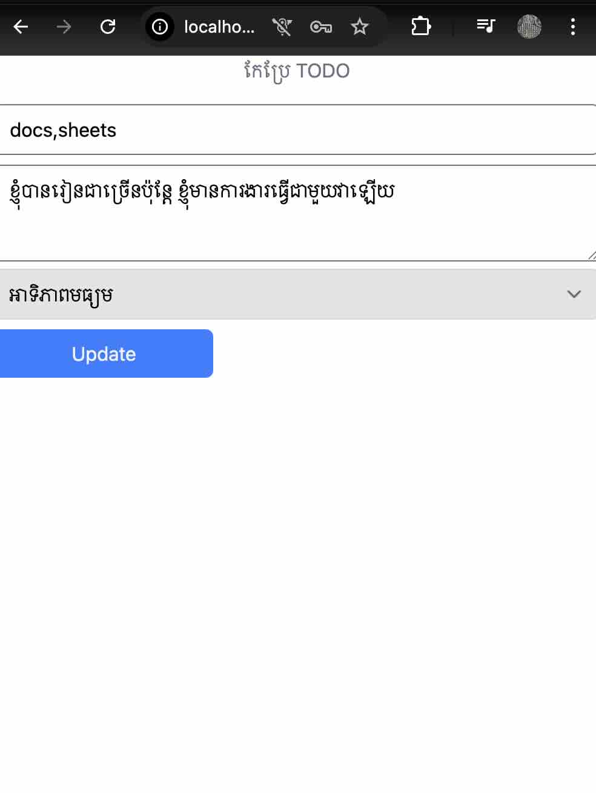

# Create user with atlas mongodb

## Structure:
```text
my-sveltekit-auth/
├── src/
│   ├── lib/
│   │   ├── server/
│   │   │   ├── db.ts        # MongoDB connection
│   │   │   └── auth.ts       # Auth utilities
│   │   └── components/
│   │       └── AuthForm.svelte
│   ├── routes/
│   │   ├── login/
│   │   │   └── +page.svelte
│   │   ├── register/
│   │   │   └── +page.svelte
│   │   ├── dashboard/
│   │   │   └── +page.svelte
│   │   └── +layout.svelte
│   └── hooks.server.ts
├── .env
└── package.json
```

## Install Package
```bash
npm create svelte@latest my-sveltekit-auth
cd my-sveltekit-auth
npm install mongodb bcryptjs jsonwebtoken dotenv
npm install --save-dev @types/bcryptjs @types/jsonwebtoken
```
## Environment Variable
```env
MONGODB_URI = mongodb://<username>:<password>@###
DB_NAME = Database name
JWT_SECRET = Generate JWT
JWT_EXPIRES_IN= "7d"
```
របៀប copy URL database ពី MongoDB Atlas មកដាក់ .env ដោយយើងធ្វើដូចខាងក្រោម:\
-> ចំណុច project click យក View all Projects  -> click យក database ណាមួយដែលត្រូវប្រើ -> នៅខាងក្រោមផ្ទាំង Clusters មានផ្ទាំងមួយឈ្មោះថា Application Development -> Connect new -> copy url ។

## ដំណើរការនៃការបង្កើត file

1.) **lib/server/db.ts**<br>
បង្កើត Database Connection
<details>
<summary>Show code (Click to expand)</summary>

```swift
import { MongoClient } from "mongodb";
import {MONGODB_URL, DB_NAME} from '$env/static/private'

const client = new MongoClient(MONGODB_URL)

export async function connectToDatabase() {
    try {
        await client.connect()
        console.log("Success Connected!")
        return client.db(DB_NAME)
    } catch (error) {
        console.error("Mongodb connection error: ", error)
        throw error
    }
}

export const db = client.db(DB_NAME)
```
</details>

2.) **lib/server/auth.ts**<br>
បង្កើត Auth Utilities
<details>
<summary>Show code (Click to expand)</summary>

```swift
import bcrypt from 'bcryptjs';
import jwt from 'jsonwebtoken';
import { JWT_SECRET, JWT_EXPIRES_IN } from '$env/static/private';
import type { Db, ObjectId } from 'mongodb';

export interface User {
  _id?: ObjectId;
  email: string;
  password: string;
  name: string;
  createdAt: Date;
  updatedAt: Date;
}

export interface JWTPayload {
  userId: string;
  email: string;
  name: string;
}

// បង្កើតអ្នកប្រើប្រាស់ថ្មី
export async function createUser(db: Db, email: string, password: string, name: string) {
  // ពិនិត្យមើលថាអ៊ីមែលមានរួចហើយឬនៅ
  const existingUser = await db.collection('users').findOne({ email });
  if (existingUser) {
    throw new Error('អ៊ីមែលនេះមានរួចហើយ');
  }

  // ធ្វើ Hashing ពាក្យសម្ងាត់
  const hashedPassword = await bcrypt.hash(password, 10);

  const user = {
    email,
    password: hashedPassword,
    name,
    createdAt: new Date(),
    updatedAt: new Date()
  };

  const result = await db.collection('users').insertOne(user);
  return { ...user, _id: result.insertedId };
}

// ផ្ទៀងផ្ទាត់ពាក្យសម្ងាត់ពេល Login
export async function verifyUser(db: Db, email: string, password: string) {
  const user = await db.collection('users').findOne({ email });
  
  if (!user) {
    return null;
  }

  const isValid = await bcrypt.compare(password, user.password);
  if (!isValid) {
    return null;
  }

  return user;
}

// បង្កើត JWT Token
export function generateToken(user: any): string {
  const payload: JWTPayload = {
    userId: user._id.toString(),
    email: user.email,
    name: user.name
  };

  return jwt.sign(payload, JWT_SECRET, {
    expiresIn: JWT_EXPIRES_IN
  });
}

// ផ្ទៀងផ្ទាត់ JWT Token
export function verifyToken(token: string): JWTPayload | null {
  try {
    return jwt.verify(token, JWT_SECRET) as JWTPayload;
  } catch (error) {
    return null;
  }
}
```
</details>

3.) **src/hooks.server.ts**<br>
ការកំណត់ Hooks សម្រាប់ Authentication
<details>
<summary>Show code (Click to expand)</summary>

```swift
import { connectToDatabase } from '$lib/server/db';
import { verifyToken } from '$lib/server/auth';
import { redirect, type Handle } from '@sveltejs/kit';

export const handle: Handle = async ({ event, resolve }) => {
  // ភ្ជាប់ទៅ MongoDB
  const db = await connectToDatabase();
  event.locals.db = db

  // ពិនិត្យមើល Token ពី Cookie
  const token = event.cookies.get('auth-token');
  
  if (token) {
    const user = verifyToken(token);
    if (user) {
      event.locals.user = user;
    } else {
      // បើ Token មិនត្រឹមត្រូវ លុប Cookie ចោល
      event.cookies.delete('auth-token', { path: '/' });
    }
  }

  // ការពារ Route ដែលត្រូវការ Login
  if (event.url.pathname.startsWith('/dashboard')) {
    if (!event.locals.user) {
      throw redirect(303, '/login');
    }
  }

  // បើអ្នកប្រើបាន Login រួចហើយ មិនអាចចូលទំព័រ Login/Register ទៀតទេ
  if ((event.url.pathname === '/login' || event.url.pathname === '/register') && event.locals.user) {
    throw redirect(303, '/dashboard');
  }


  return resolve(event);
};
```
</details>

4.) **lib/components/AuthForm.svelte**<br>
បង្កើត Login/Register Form Component
<details>
<summary>Show code (Click to expand)</summary>

```swift
<script lang="ts">
  let { form = null, type = 'login' } = $props();
  console.log(type)
</script>

<form method="POST" class="auth-form">
  {#if type === 'register'}
    <div class="form-group">
      <label for="name">ឈ្មោះពេញ</label>
      <input 
        type="text" 
        id="name" 
        name="name" 
        value={form?.name || ''}
        required
      />
    </div>
  {/if}

  <div class="form-group">
    <label for="email">អ៊ីមែល</label>
    <input 
      type="email" 
      id="email" 
      name="email" 
      value={form?.email || ''}
      required
    />
  </div>

  <div class="form-group">
    <label for="password">ពាក្យសម្ងាត់</label>
    <input 
      type="password" 
      id="password" 
      name="password" 
      required
    />
  </div>

  {#if type === 'register'}
    <div class="form-group">
      <label for="confirmPassword">បញ្ជាក់ពាក្យសម្ងាត់</label>
      <input 
        type="password" 
        id="confirmPassword" 
        name="confirmPassword" 
        required
      />
    </div>
  {/if}

  {#if form?.error}
    <div class="error-message">
      {form.error}
    </div>
  {/if}

  <button type="submit" class="submit-btn">
    {type === 'login' ? 'ចូលប្រើ' : 'ចុះឈ្មោះ'}
  </button>
</form>
```
</details>


5.) routes/resister/
- +page.server.ts
- +page.svelte

6.) routes/login/
- +page.server.ts
- +page.svelte

## Image Preview:





